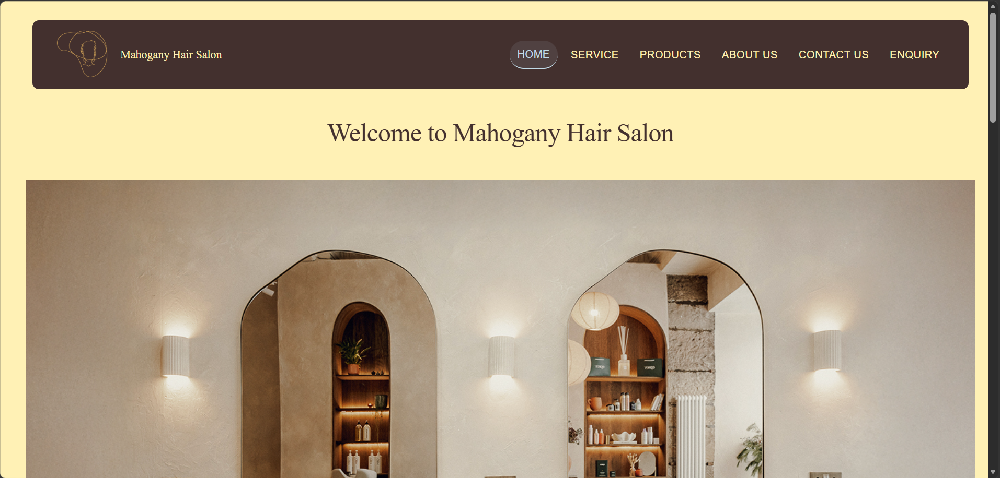

# Mahogany Hair Salon Website

## Project Overview
This is the official website for **Mahogany Hair Salon**, a premier hair care and beauty service located at 19 Plein Street, Polokwane 0700, Limpopo, South Africa. The salon specializes in premium human hair wigs, braiding, wig installations, nail art, makeup looks, and haircare products. Founded in 2022 by Mahogany Adom, it targets university students, natural hair clients, and budget-conscious professionals.

The site is a static HTML website using table-based layouts for structure, inline styles, and image-heavy design. It features a consistent header with navigation, footer with team, links, and contact info, and responsive-friendly widths.

## Features
- **Home (index.html)**: Hero banner, services overview (braiding, wigs, makeup, nails), haircare products intro.
- **About Us**: Salon history (started 2022 dorm service), mission, vision, target audience, team members.
- **Services**: Detailed pricing for braiding (R250-R380), wig installs (R280-R550), nails (R230-R380), makeup (R450-R580).
- **Products**: Haircare (shampoo/conditioner R300, oil R170 etc.), human hair bundles (R600-R800).
- **Contact Us**: Google Maps embed, address, phone (+27 65 383 4718), email (mahoHair@gmail.com), opening hours.
- **Enquiry**: Contact form with name, email, subject, message.
- **Assets**: Images for services/products, logo, fonts/CSS/JS folders (unused in core pages), media.

05/04/2026
Created the folder for the business, added the sub folders(Assets, Miscellaneous, Pages) then added about us and contact us under Pages.
Started coding for index.html, created the html pages and added the navigation links to all the pages.

07/04/2026
Added a hero image to all the html pages and edited the pages to look the same with the links located on the right-hand side, the logo and the business name on the left-hand side. 
Added the images that would be used in the building of the website and added service.html and products.html under pages.
Added sections in index.html that contains our services and the products the the business sells in store


12/04/2026
Started editing the code for the pages to look similar. And added the pictures in the code.

17/04/2026
Started coding the enquiry page and added the location map in contact us. Added more pictures in Assets to create a more sofisticated look to the website. 
Added the pictures in products and aligned them with the prices of each product and naming all the products, added the pictures to services and the description of Who we are, our vision and mission statements, our target market our team and history. 
Added the copyright footer and applied it to all the pages.
Added the founders picture in about us, next to the texts

19/04/2026
Added the more to the footer with about us(Which contains the names of our members on the left-hand side), important links located in the middle and contact us located on the right-hand side of the page.
Created the same footer for all the pages.

20/04/2026
Moved the Human hair bundles from the services section in the homepage to Our Haircare Products section and renamed it to Our products

## File Structure
```
Mahogany_Hair_Salon/
├── index.html
├── Pages/
│   ├── about_us.html
│   ├── contact_us.html
│   ├── enquiry.html
│   ├── products.html
│   └── service.html
├── Assets/
│   ├── Images/ (all product/service photos, logo, hero)
│   ├── css/, Fonts/, js/, Media/
├── Components/ (unused)
├── Miscellaneous/
│   └── README.md (this file), TODO.md
└── .gitattributes
```

## Update History
| Page/File | Description | Update Date |
|-----------|-------------|-------------|
| index.html | Initial home page with hero, services preview | 2024-09-15 |
| Pages/about_us.html | Added history, mission, team details | 2024-09-20 |
| Pages/service.html | Full services with images/pricing (braids, wigs, nails, makeup) | 2024-09-25 |
| Pages/products.html | Products catalog with prices | 2024-09-25 |
| Pages/contact_us.html | Map, contact details, hours | 2024-09-28 |
| Pages/enquiry.html | Enquiry form implementation | 2024-09-28 |
| Miscellaneous/README.md | Added this comprehensive README | 2024-10-01 |

## How to Run
1. Open `index.html` in any web browser (Chrome, Firefox, etc.).
2. Navigate via header links.
No server or dependencies required.

## Technical Notes
- Built with pure HTML5, inline CSS (no external stylesheets used yet).
- Table layouts for compatibility.
- Images optimized for web; all paths relative.
- © 2026 footer (update as needed).
- Future improvements: Add CSS/JS, mobile responsiveness, form backend.

## Contact
- Phone: +27 65 383 4718
- Email: mahoHair@gmail.com
- Website: Open index.html


PART 2 CHANGELOG

16/05/2026
Added style.css and linked it to index.html
Linked style.css to index.html
Added basic styling for header, navigation, and footer

17/04/2026 - Page Development
Started coding enquiry page and added location map in contact us
Added more pictures to Assets
Added product images with prices
Added service images with descriptions
Added about us content (who we are, vision, mission, target market, team)
Added copyright footer and applied to all pages
Added founder picture in about us
Coded enquiry page with contact form
Added Google Maps embed to contact us page
Added more images to Assets folder
Added about us content (who we are, vision, mission, target market, team)
Added copyright footer to all pages
Added founder picture to about us page

19/04/2026 - Footer Creation
Added footer with About Us (members list), Important Links, and Contact Us
Applied consistent footer to all pages

20/04/2026 - Content Restructuring
Moved Human hair bundles from services section to Our Products section
Renamed section to "Our Products"
Added footer with three sections: About Us (team members), Important Links, Contact Us
Applied CSS Grid for footer layout
Made footer responsive (3 columns on desktop, 2 on tablet, 1 on mobile)
Added hover effects for footer links

21/05/2026 - External CSS Integration
Created style.css external stylesheet
Linked CSS to all HTML pages (index, about_us, contact_us, enquiry, products, service)
Applied consistent styling across all pages

22/05/2026 - Button Styling
Created .btn class with hover, focus, active pseudo-classes
Created .btn-secondary for outline button style
Added box-shadow and transform effects on hover
Added focus outline for accessibility

24/05/2026 - Typography Implementation
Added Google Fonts: Playfair Display (headings) and Poppins (body)
Set typography scale: h1 (2.5rem), h2 (2rem), h3 (1.5rem), body (1rem)
Added responsive typography for tablet and mobile

25/05/2026 - Color Scheme Finalization
Defined CSS custom properties for colors
Buttermilk #FFF1B5 - Background color
Pastel Blue #C1DBE8 - Hover states, borders, accents
Old Burgundy #43302E - Header, footer, text, buttons

26/05/2026 - Enquiry Form Styling
Created styled enquiry form with card-like appearance
Added two-column layout for name and email fields
Added form validation styling (required fields, focus states)
Added submit button with hover effect

27/05/2026 - Product Page and Service Page Enhancements
Added btn-prod class for product price buttons
Updated all service and product tables with price buttons
Added hover effects for product images (scale + gold shadow)

29/05/2026 - Final CSS and Responsive Design Updates (Part 2)
CSS Additions:

Added .products-img class with box-shadow, border-radius, and hover scale effect
Added .img-hero class with hover zoom and shadow effect
Added .btn-prod class for product price buttons with hover state
Added .font class for bold text styling
Added .active class for current page navigation highlighting
Added enquiry form styling (.enquiry-form, .form-group, .form-row, .submit-btn)
Added responsive table stacking for mobile devices

Responsive Design Implementation:
Tablet Breakpoint (768px - 1023px): Font sizes reduced (h1: 2rem, h2: 1.75rem), footer 2 columns, navigation remains horizontal
Mobile Breakpoint (≤767px): Font sizes reduced further (h1: 1.75rem, h2: 1.5rem), navigation becomes 3-column grid, footer becomes single column, tables stack vertically, header stacks vertically

Navigation Updates:
Changed header from table-based layout to flexbox layout
Logo and navigation links now use justify-content: space-between
Active page indicator with color: #C1DBE8 and bottom border
Mobile navigation: 3-column grid layout

Footer Updates:
Desktop: 3 columns using CSS Grid (grid-template-columns: repeat(3, 1fr))
Tablet: 2 columns
Mobile: 1 column (stacked vertically)

Enquiry Form Updates:
Two-column layout for name and email on desktop
Single column on mobile
Custom styling for inputs, select, textarea with hover and focus effects

File structure
Mahogany_Hair_Salon/
├── index.html
├── style.css
├── Assets/
│ ├── css/
│ │ └── style.css
│ ├── Images/
│ │ ├── newer_logo.png
│ │ ├── Hero_banner.jpg
│ │ ├── hero_image_about_us.jpg
│ │ ├── braided_back.jpg
│ │ ├── braided_head.jpg
│ │ ├── braided_short.jpg
│ │ ├── hair_kinky.jpg
│ │ ├── hair_kinky_short.jpg
│ │ ├── hair_long.jpg
│ │ ├── hair_long_side.jpg
│ │ ├── hair_short.jpg
│ │ ├── hair_short_color.jpg
│ │ ├── nail_2.jpg
│ │ ├── nails.jpg
│ │ ├── plain_nails.jpg
│ │ ├── plain_nails_2.jpg
│ │ ├── nails_square.jpg
│ │ ├── nails_square_2.jpg
│ │ ├── makeup.jpg
│ │ ├── makeup_2.jpg
│ │ ├── makeup_3.jpg
│ │ ├── product_condi_shamp.jpg
│ │ ├── product_hairfood.jpg
│ │ ├── product_oil.jpg
│ │ ├── product_spray.jpg
│ │ ├── hair_bundles.jpg
│ │ ├── straight_bundles.jpg
│ │ └── bundles_kinky.jpg
│ ├── Fonts/
│ ├── js/
│ └── Media/
├── Pages/
│ ├── about_us.html
│ ├── contact_us.html
│ ├── enquiry.html
│ ├── products.html
│ └── service.html
└── Miscellaneous/
└── README.md

DESKTOP SCREENSHOTS

Home page


References

Fonts
Google Fonts. (2026). Playfair Display. Available at: https://fonts.google.com/specimen/Playfair+Display (Accessed: 29 May 2026).
Google Fonts. (2026). Poppins. Available at: https://fonts.google.com/specimen/Poppins (Accessed: 29 May 2026).

CSS Tutorials and Documentation
MDN Web Docs. (2026). CSS Flexbox. Available at: https://developer.mozilla.org/en-US/docs/Web/CSS/CSS_Flexible_Box_Layout (Accessed: 29 May 2026).
MDN Web Docs. (2026). CSS Grid Layout. Available at: https://developer.mozilla.org/en-US/docs/Web/CSS/CSS_Grid_Layout (Accessed: 29 May 2026).
MDN Web Docs. (2026). Responsive Design. Available at: https://developer.mozilla.org/en-US/docs/Learn/CSS/CSS_layout/Responsive_Design (Accessed: 29 May 2026).
MDN Web Docs. (2026). Using CSS transitions. Available at: https://developer.mozilla.org/en-US/docs/Web/CSS/CSS_Transitions/Using_CSS_transitions (Accessed: 29 May 2026).
MDN Web Docs. (2026). CSS selectors. Available at: https://developer.mozilla.org/en-US/docs/Web/CSS/CSS_Selectors (Accessed: 29 May 2026).
W3Schools. (2026). CSS Media Queries. Available at: https://www.w3schools.com/css/css_rwd_mediaqueries.asp (Accessed: 29 May 2026).
W3Schools. (2026). CSS Box Shadow. Available at: https://www.w3schools.com/css/css3_shadows_box.asp (Accessed: 29 May 2026).

Smooth Scroll Tutorial
codewithtoushif. (2026). Smooth Scroll Navigation with CSS Only | Fix Anchor Link Jump. Instagram. Available at: https://www.instagram.com/p/DViz8pXgEMl/ (Accessed: 29 May 2026).

Icons
Font Awesome. (2026). Free Icons. Available at: https://cdnjs.cloudflare.com/ajax/libs/font-awesome/6.4.0/ (Accessed: 29 May 2026).

Images
Mahogany Hair Salon. (2026). Original salon photography. [Images] Available at: Assets/Images/ (Accessed: 29 May 2026).

Color Palette Reference
Dotnuance. (2026). Color Palette. Available at: https://www.dotnuance.com (Accessed: 29 May 2026).

Google Maps Embed
- Google Maps. (2026). 19 Plein Street, Polokwane. Available at: https://maps.google.com/?q=19+Plein+Street+Polokwane (Accessed: 29 May 2026).